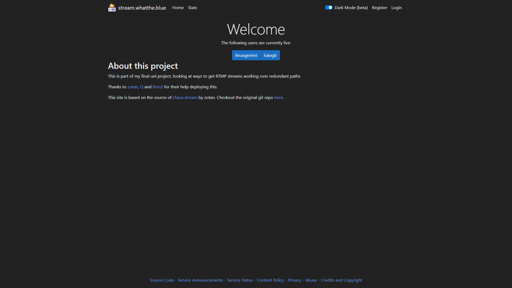
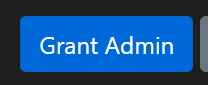
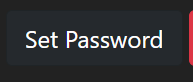

# RTMPDash-blue

RTMPDash-blue is an evolution of the project [RTMPDash](https://git.ztn.sh/zotan/rtmpdash). It has been migrated to .NET 8, and has support for HLS streams.

# [Production instance](https://stream.whatthe.blue)

## Acknowledgements
Thanks to the following people for helping me out with:

 Idea development:
 - alliejp
 - Anna, from BT M&B
 - [John Ellerton](https://www.linkedin.com/in/john-ellerton-26271b74/)
 - [SMPTE UK](https://www.smpte.org/sections/united-kingdom)

 Hardware:
 - [Eric](https://www.linkedin.com/in/ericdsouza/) from [Motion Picture Solitions](https://www.withmps.com/) for providing 2 EoL servers for me to host this on
 - [Glauca Digital](https://glauca.digital) for lending me 1U in their Leeds datacentre and an IPv4 address

 Deployment:
 - [zotan](https://zotan.pw)  
 - [Q](https://magicalcodewit.ch)
 - [bonzi](https://bonzi.sh)
 - [Maz](https://maz.nu/) from [Faelix](https://faelix.net/) for providing me space in Equinix MA5 

 Testing:

 - [daf](https://daf.wales/)
 - [linuxgemini](https://linuxgemini.space/)
 - [connormcf](https://connormcf.com/)
 - [luna](https://ne0.us)
 - [kunsi](https://franzi.business/)

# Installation

Start by installing the following __dependancies__:

 - [dotnet-sdk-8.0](https://learn.microsoft.com/en-gb/dotnet/core/install/linux-debian#install-the-sdk)
 - [nginx 1.22.1](https://nginx.org/en/download.html) - for the web server
   - [Certbot](https://certbot.eff.org/) - for SSL certificates
 - [nginx-mod-rtmp](https://git.ztn.sh/zotan/nginx-mod-rtmp) - to ingest the RTMP
 - [Video.js](https://github.com/videojs/video.js) - for the player
 - [vnstat, vnstati](https://humdi.net/vnstat/) - to monitor network traffic and make the images used on the stats page
 - [redis](https://github.com/redis/redis)

## Installing

- Clone the repo into `/opt`
 

- Adjust the following `const`s in `/Backend/Program.cs`:
  - `SiteName` name of the site
 

  - _The following domains must be updated in your `nginx.conf` too:_
    - `IngressDomain` domain users will send their RTMP to - Make sure it starts with `rtmp://`
    - `RootDomain` main domain used for the site
    - `PlayerDomain` domain used by the player
    - `FragmentDomain` domain used by the cdn
    - `StatsDomain` domain used for the stats
 

  - _`mailto:` is added automatically for the following, just put in the address:_
    - `PrivacyEmail` email for privacy
    - `CopyrightEmail` email for copyright
    - `AbuseEmail` email for abuse
 

  - _The following are in the footer of the site:_
    - `SourceUrl` the "Source Code" link in the footer
    - `ServiceAnnouncementUrl` the "Service Announcements" link in the footer
    - `ServiceStatusUrl` the "Service Status" link in the footer
 

  - `ContactInfo` is shown on the Dashboard page - this is HTML
 

  - __Don't change__ `RtmpStatsUrl` - nginx-mod-rtmp exposes information about the current connected clients on this port - _(unless you know what you're doing, in that case go wild)_.
    - Default value: `"http://127.0.0.1:8083"`
 

- Install [nginx-mod-rtmp](https://git.zotan.services/zotan/nginx-mod-rtmp)
- Configure nginx-mod-rtmp, example config in [`/configs/nginx.conf`](/configs/nginx.conf)
 

- Start `redis` for persistent sessions
 

- Setup the player:  
  - Move [`/configs/watch.html`](/configs/watch.html) to `/var/www/player`
    - This requires the Video.js library in `/var/www/player/lib`
  - Put a 1920x1080px PNG named `offline.png` in `/var/www/liveon/lib/`. This shown when a user is offline. An example is in [`/configs/offline.png`](/configs/offline.png).
   

- Setup the stats page, by adjusting the following variables in [`/stats.sh`](/stats.sh):
  - `imgdir` is the directory that `stats.stream.*` is pointed to in nginx
  - `interface` is the network interface to monitor. To add more than one interface use the format `"iface1+iface2"`
- Move [`/configs/rtmpstats.cron`](configs/rtmpstats.cron) to `/etc/cron.d`
  - This currently runs every 15 mins, but can be adjusted to your liking
 

- Start RTMPDash
  - example systemd unit in [`/configs/rtmpdash.service`](/configs/rtmpdash.service)
  - On first startup the `admin` user's password is output to `stdout`, when started with the systemd unit it will be in journal
- login with the default user, admin. See below for how to add more users.
 

### Further setup

- Run [Certbot](https://certbot.eff.org/instructions) to generate SSL certs
- Customise privacy policy in [`Pages/Privacy.cshtml`](Pages/Privacy.cshtml) to your environment
- Customise content policy in [`Pages/Content.cshtml`](Pages/Privacy.cshtml) to your liking
- Customise homepage in [`Pages/Index.cshtml`](/Pages/Index.chtml)
- Customise player in `/var/www/player/watch.html`

### How do I...?

 - Generate invite codes?
   - Login as an admin and go to the "Admin" page
   - Scroll down and hit "Generate New Invite"
   - _This is unique to each user, and will disappear when a user registers._

 

- Make someone else an admin?
  - Login as an admin and go to the "Admin" page
  - Click "Grant Admin" next to the relevant user

 

- Delete a user?
  - Login as an admin and go to the "Admin" page
  - Click "Delete" next to the relevant user
  
  - _You cannot delete admins. Revoke admin first, then delete._

- Reset someone's password?
  - Login as an admin and go to the "Admin" page
  - Click "Set Password" next to the relevant user
  
  - _You cannot reset passwords for other admins. See below if you forgot your admin password_
   

- Reset my password and I'm the only admin?
  - You have no choice but to delete the entire user database and create a new one
    - _You will have to re-invite all users_
    - `rm app.db` and reload the service
  - The new password will be in the journal of the system.d unit